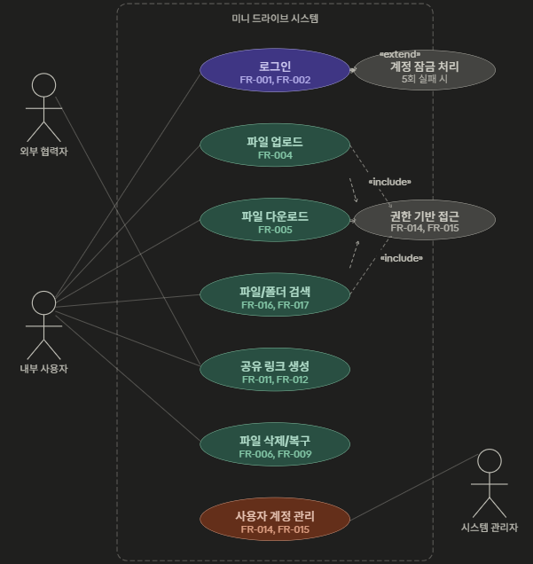
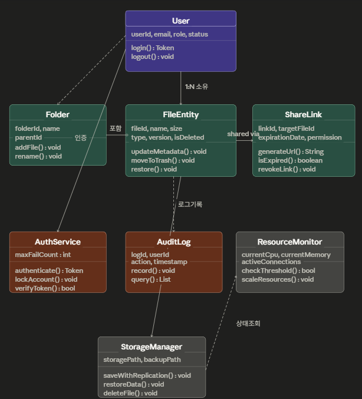
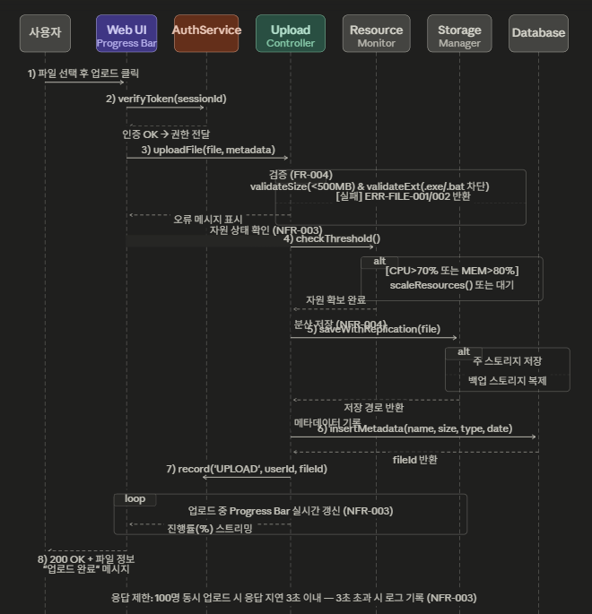

# 클라우드 파일 공유 시스템(미니드라이브) 요구사항 분석서

---

## 목 차

1. 기능 관점 — 유스케이스 다이어그램
2. 유스케이스 설명서
3. 구조 관점 — 클래스 다이어그램
4. 행위 관점 — 순차 다이어그램
5. 요구사항 추적 매트릭스 (Traceability Matrix)

---

## 1. 기능 관점 — 유스케이스 다이어그램

요구사항 정의서(v1.2)의 FR-001 ~ FR-017 및 이해관계자 기대치를 기반으로,  
시스템 액터를 **내부 사용자 / 외부 협력자 / 시스템 관리자**로 분류하여 작성함

### 1.1 액터 정의

| 액터 | 설명 | 주요 관심사 |
|---|---|---|
| 내부 사용자 | 조직에 소속된 직원 (팀원), 이메일/비밀번호로 인증 | 편리한 업로드·다운로드, 빠른 검색, 팀 협업 |
| 외부 협력자 | 공유 링크로만 접근하는 비조직 사용자 | 만료 기간 내 안전한 파일 접근 |
| 시스템 관리자 | 계정 생성/삭제 및 자원 할당 권한 보유 | 계정 통제, 저장 공간 할당, 감사 로그 |

### 1.2 관계 표기

- `<<include>>` : 항상 포함되는 필수 절차 (예: 모든 파일 작업은 권한 검사를 포함)
- `<<extend>>` : 특정 조건에서만 발생하는 확장 절차 (예: 로그인 5회 실패 시 계정 잠금)

---

## 2. 유스케이스 설명서

---

### 2.1 UC-002: 고가용성 파일 업로드 (High-Availability File Upload)

| 항목 | 상세 내용 |
|---|---|
| 유스케이스명 | 고가용성 파일 업로드 (High-Availability File Upload) |
| 유스케이스 ID | UC-002 |
| 관련 요구사항 | FR-004, FR-008, NFR-003, NFR-004 |
| 관련 액터 | 내부 사용자 (Primary) |
| 사전 조건 | 사용자가 시스템에 로그인되어 있어야 하며, 파일 크기가 500MB 이하이고 실행 파일(.exe, .bat, .sh)이 아니어야 함 |
| 사후 조건 | 파일이 스토리지에 저장되고 메타데이터가 DB에 기록되며, 사용자에게 완료 메시지가 전달됨 |
| 정상 흐름 | 1. 사용자가 업로드할 파일을 선택하여 요청 2. 시스템은 현재 자원(CPU/메모리) 상태를 확인하여 로드를 분산 3. 스토리지가 파일을 안전하게 분산 저장하고 메타데이터(날짜, 크기 등)를 DB에 기록 4. 사용자 UI에 실시간 진행률을 표시하고 완료 메시지 반환 |
| 대안/예외 흐름 | [E1] 파일 크기 초과(>500MB) → 'ERR-FILE-001: 파일 크기 초과' 메시지 표시 [E2] 차단 확장자 → 'ERR-FILE-002: 업로드 불가 파일 형식' 메시지 표시 [E3] 저장 공간(Quota) 초과 → '저장 공간이 부족합니다' 메시지 표시 및 작업 취소 [E4] 장애 발생 시 백업 스토리지로 구제하여 자동 재시도 메커니즘 3회 수행 |
| 품질 제약 | 200명 동시 업로드 요청 시에도 응답 지연 시간 3초 이내 유지 (NFR-003) |

---

### 2.2 UC-001: 사용자 로그인

| 항목 | 상세 내용 |
|---|---|
| 유스케이스명 | 사용자 로그인 |
| 유스케이스 ID | UC-001 |
| 관련 요구사항 | FR-001, FR-002, NFR-006 |
| 관련 액터 | 내부 사용자 |
| 사전 조건 | 관리자가 계정을 사전 생성한 상태 |
| 사후 조건 | 인증 토큰이 발급되고 메인 화면으로 진입 |
| 정상 흐름 | 1. 사용자가 이메일/비밀번호 입력 2. 시스템이 입력 정보를 검증 3. 권한 정보를 함께 로드하여 세션 생성 4. 메인 화면으로 리다이렉트 |
| 대안/예외 흐름 | [E1] 비밀번호 불일치 → 시도 횟수 +1 [E2] 5회 실패 시 30분간 계정 잠금 (FR-001) |
| 품질 제약 | 전송 중 SSL/TLS 암호화 필수 (NFR-006) |

---

### 2.3 UC-005: 공유 링크 생성 및 외부 다운로드

| 항목 | 상세 내용 |
|---|---|
| 유스케이스명 | 공유 링크 생성 및 외부 다운로드 |
| 유스케이스 ID | UC-005 |
| 관련 요구사항 | FR-011, FR-012, FR-013 |
| 관련 액터 | 내부 사용자(생성), 외부 협력자(접근) |
| 사전 조건 | 공유 대상 파일이 존재하며 사용자가 해당 파일의 공유 권한을 보유 |
| 사후 조건 | 고유 URL이 생성되고 외부 협력자가 만료일까지 파일에 접근 가능 |
| 정상 흐름 | 1. 사용자가 파일 선택 후 '공유 링크 생성' 요청 2. 권한(읽기/수정/댓글) 및 만료일 설정 3. 시스템이 고유 토큰 URL을 생성하여 반환 4. 외부 협력자가 URL 접근 → 만료 여부 검증 후 다운로드 |
| 대안/예외 흐름 | [E1] 만료된 링크 접근 시 '만료된 링크' 안내 페이지 표시 (FR-012) [E2] 권한 없는 작업 시도 시 ERR-AUTH-001 반환 |
| 품질 제약 | 모든 접근은 Audit Trail로 기록 |

---

### 2.4 UC-003: 파일 및 폴더 검색

| 항목 | 상세 내용 |
|---|---|
| 유스케이스명 | 파일 및 폴더 검색 |
| 유스케이스 ID | UC-003 |
| 관련 요구사항 | FR-016, FR-017, NFR-003 |
| 관련 액터 | 내부 사용자 |
| 사전 조건 | 사용자가 로그인된 상태이며 읽기 전용 이상의 권한 보유 |
| 사후 조건 | 검색 조건에 맞는 파일/폴더 목록이 1초 내 반환됨 |
| 정상 흐름 | 1. 사용자가 파일명 키워드 입력 또는 확장자·날짜 필터 선택 2. 시스템이 캐시(Redis)를 우선 조회하고 캐시 미스 시 DB 검색 3. 권한 필터링 후 결과 목록 반환 4. 사용자 화면에 결과 표시 |
| 대안/예외 흐름 | [E1] 검색 결과 없음 → '검색 결과가 없습니다' 메시지 표시 [E2] 권한 없는 폴더 결과는 목록에서 제외 |
| 품질 제약 | 파일 목록 및 검색 결과는 1초 내로 반환 (NFR-003) |

---

### 2.5 UC-004: 파일 삭제 및 복구

| 항목 | 상세 내용 |
|---|---|
| 유스케이스명 | 파일 삭제 및 복구 |
| 유스케이스 ID | UC-004 |
| 관련 요구사항 | FR-006, FR-009 |
| 관련 액터 | 내부 사용자 |
| 사전 조건 | 편집 가능 이상의 권한을 가진 사용자가 로그인된 상태 |
| 사후 조건 | 삭제 시 파일이 휴지통으로 이동되어 일정 기간 복구 가능 상태 유지 |
| 정상 흐름 | 1. 사용자가 파일 선택 후 삭제 버튼 클릭 2. 시스템은 파일을 즉시 삭제하지 않고 휴지통으로 이동 3. 사용자가 휴지통에서 복구 버튼 클릭 시 원래 위치로 파일 복원 4. 복구 완료 메시지 표시 |
| 대안/예외 흐름 | [E1] 복구 대상 파일이 스토리지에 없을 경우 오류 메시지 표시 [E2] 휴지통 보관 기간 만료 시 영구 삭제 처리 |
| 품질 제약 | 삭제된 파일은 최소 30일간 복구 가능 상태 유지 |

---

### 2.6 UC-006: 사용자 계정 및 권한 관리

| 항목 | 상세 내용 |
|---|---|
| 유스케이스명 | 사용자 계정 및 권한 관리 |
| 유스케이스 ID | UC-006 |
| 관련 요구사항 | FR-014, FR-015 |
| 관련 액터 | 시스템 관리자 |
| 사전 조건 | 시스템 관리자 권한으로 로그인된 상태 |
| 사후 조건 | 신규 계정 생성 또는 권한 변경이 DB에 반영됨 |
| 정상 흐름 | 1. 관리자가 신규 사용자 이메일, 초기 비밀번호, Quota 입력 2. 시스템이 중복 이메일 여부 확인 3. 계정 생성 및 RBAC 역할 할당 4. 생성 완료 메시지 출력 |
| 대안/예외 흐름 | [E1] 중복 이메일 → '이미 사용 중인 이메일입니다' 메시지 [E2] 권한 없는 사용자가 접근 시 ERR-AUTH-001 반환 |
| 품질 제약 | 모든 계정 변경 이력은 AuditLog에 기록 |

---

## 3. 구조 관점 — 클래스 다이어그램

요구사항에 명시된 자원 모니터링, 분산 저장, RBAC 개념을 클래스로 도출하였습니다.

### 3.1 클래스 책임 요약

| 클래스명 | 주요 속성 | 주요 메서드 | 역할 |
|---|---|---|---|
| User | userId, email, role, status | login(), logout() | 시스템 접근 주체 정의 |
| FileEntity | fileId, name, size, type, version, isDeleted | updateMetadata(), moveToTrash() | 파일의 메타데이터 및 상태 관리 |
| Folder | folderId, name, parentId | addFile(), rename() | 다단계 폴더 구조 지원 |
| ShareLink | linkId, targetFileId, expirationDate, permission | generateUrl(), isExpired() | 외부 공유를 위한 링크 제어 |
| ResourceMonitor | currentCpu, currentMemory, activeConnections | checkThreshold(), scaleResources() | 가용성 제어: 서버 자원 임계치(70%/80%) 관리 |
| StorageManager | storagePath, backupPath | saveWithReplication(), restoreData() | 신뢰성 보장: 분산 저장 및 24시간 복구 지점 관리 |
| AuthService | maxFailCount | authenticate(), lockAccount() | 인증 및 계정 잠금 처리 |
| AuditLog | logId, userId, action, timestamp | record() | 파일별 접근 로그 기록 |

### 3.2 관계 설명

- **연관( → )**: User-FileEntity (소유 관계, 1:N)
- **집합( ◇→ )**: Folder가 FileEntity와 하위 Folder를 포함하나, Folder 삭제 시 내부 파일은 휴지통으로 이동 가능 (약한 결합)
- **의존( ‥› )**: StorageManager가 ResourceMonitor의 상태를 조회하여 저장 전략 결정

---

## 4. 행위 관점 — 순차 다이어그램

UC-002(고가용성 파일 업로드)의 시간 순서에 따른 객체 간 메시지 흐름을 표현합니다.

### 4.1 메시지 흐름 해설

1. **1~2단계** — 사용자가 파일을 선택하면 UI가 인증 토큰의 유효성을 먼저 확인함
2. **3단계** — UploadController가 파일 크기/확장자 검증을 수행하여 차단 정책을 적용함 (FR-004)
3. **4단계** — ResourceMonitor가 CPU·메모리·연결 수를 조회해 임계치를 초과하면 자동 스케일링하거나 대기열로 보냄
4. **5단계** — StorageManager가 주/백업 스토리지에 이중 저장하여 장애 시 우회 복구가 가능하도록 함 (NFR-004)
5. **6~7단계** — 메타데이터를 DB에 기록하고 AuditLog에 행위를 기록
6. **반복 구간** — 업로드 중 Progress Bar가 실시간으로 % 진행률을 사용자에게 보여줌 (인터페이스 요구사항)

---

## 5. 요구사항 추적 매트릭스 (Traceability Matrix)

| 요구사항 ID | 요구사항 명 | 유스케이스 | 클래스 | 순차 다이어그램 단계 |
|---|---|---|---|---|
| FR-001 | 사용자 로그인 | UC-001 | AuthService, User | 2 |
| FR-002 | 사용자 로그아웃 | UC-001 | User | — |
| FR-003 | 사용자 로그아웃 | UC-001 | AuthService | — |
| FR-004 | 파일 업로드 | UC-002 | FileEntity, StorageManager | 3 |
| FR-005 | 파일 다운로드 | UC-002 | FileEntity | — |
| FR-006 | 파일 삭제(휴지통) | UC-004 | FileEntity (moveToTrash) | — |
| FR-007 | 파일명 변경 | UC-002 | FileEntity | — |
| FR-008 | 메타데이터 저장 | UC-002 | FileEntity, Database | 6 |
| FR-009 | 파일 복구 | UC-004 | FileEntity, StorageManager | — |
| FR-010 | 폴더 이동 | UC-002 | Folder | — |
| FR-011 | 공유 링크 생성 | UC-005 | ShareLink | — |
| FR-012 | 링크 만료 설정 | UC-005 | ShareLink | — |
| FR-013 | 외부 다운로드 | UC-005 | ShareLink | — |
| FR-014 | 권한 부여 | UC-006 | User (role), AuthService | 2 |
| FR-015 | 접근 차단 | UC-006 | AuthService, AuditLog | 2 |
| FR-016 | 파일명 검색 | UC-003 | FileEntity | — |
| FR-017 | 필터 검색 | UC-003 | FileEntity | — |
| NFR-003 | 3초 내 응답 | UC-002, UC-003 | ResourceMonitor | 4 (전체) |
| NFR-004 | 500MB 용량 제한 | UC-002 | StorageManager | 5 |
| NFR-006 | 비밀번호 암호화 | UC-001 | AuthService | 2 |
| NFR-007 | 링크 만료 차단 | UC-005 | ShareLink | — |
| NFR-008 | 접근 시도 로그 | 전 유스케이스 | AuditLog | 7 |
| IR-001 | REST API 통신 | 전 유스케이스 | 전 클래스 | 전 단계 |
| IR-002 | 저장소 연동 | UC-002 | StorageManager | 5 |

